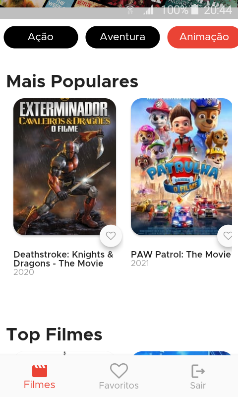

<h2>📖 Sobre</h2>

<p>
    Este projeto foi desenvolvido com o intuído de testar conhecimentos e sobre o interesse em participar do processo seletivo para vaga de dev Flutter na Anthor.
</p>


---

<h2>📱 Preview</h2>

   <p align="center">
      
      
      
   </p>

---   

<h2>🛠️ Funcionalidades e Tecnologias Estudadas</h2>

- Consulta da API do The Movie Database usando o package Dio
- GetX como Gerenciamento de Estado
- Postman Collections: API de Desenvolvimento e Testes
- Fluxo de Login e Logout com a aplicação
- Navigator 2.0
- Themes
- Search
  - Busca de filmes via pesquisa
  - Busca de filmes com base na lista de Categoria com os gêneros de filmes
- Firebase
  - Core
  - Auth | Sign-in
  - RemoteConfig
- Telas: 
  - Login (onde possui o fluxo de login)
  - Splash (tela inicial do app para transição)
  - Home (tela principal do app e que serve de fluxo inicial para as demais telas descritas abaixo)
  - Movies (parte da view onde nós da a porta para a escolha da lista de filmes)
- Teria a movie details e a favorite movies. 🔥
   </p>


---

<h2>🤔 Como usar</h2>

   ```
   Configure o ambiente de desenvolvimento na sua máquina:
   https://flutter.dev/docs/get-started/install

   - Clone o repositório:
   $ git clone https://github.com/John-Rocha/app_filmes.git

   - Entre no diretório:
   $ cd app_filmes

   - Instale as dependências:
   $ flutter pub get

   - Execute:
   $ flutter run
   ```

---

<h2>Dificuldades</h2>

<ul>
    <li>Tempo</li>
    <li>Covid (tomei a vacina e tive reação)</li>
    <li>Acabei escolhendo uma arquitetura muito desacoplada kkkk</li>
</ul>

---
<p>Créditos do readme para o https://github.com/John-Rocha
